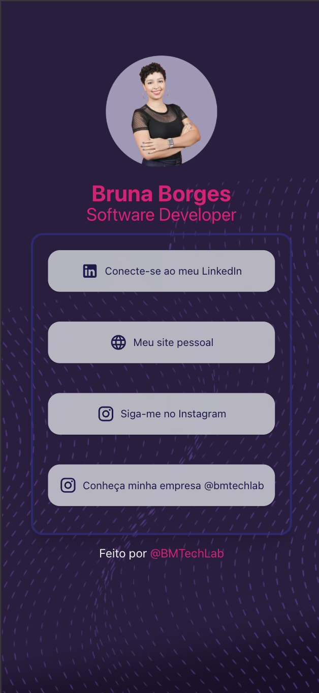

# Bruna Dev Links

A minimal and fast "linktree" in bio page built with Next.js App Router and Tailwind CSS. It uses glassmorphism cards and icon variants for Instagram, LinkedIn, GitHub, and Website.

**Live:** https://brunadev-links.vercel.app/

---

## Preview

---

## Features

- Next.js App Router + Tailwind CSS
- Glassmorphism link cards with hover and focus states
- Icon variants using MUI Icons (Instagram, LinkedIn, GitHub, Website)
- Fully responsive and mobile first
- Accessible labels for links (aria label)
- Ready to deploy on Vercel

---

## Tech Stack

- Next.js 14+
- React 18
- Tailwind CSS
- TypeScript
- MUI Icons (`@mui/icons-material`)

---

## Getting Started

### Prerequisites
- Node.js 18 or newer
- npm or pnpm

### Install

npm install
or
pnpm install

## Run in development
- npm run dev

## Build and start
- npm run build
- npm run start

